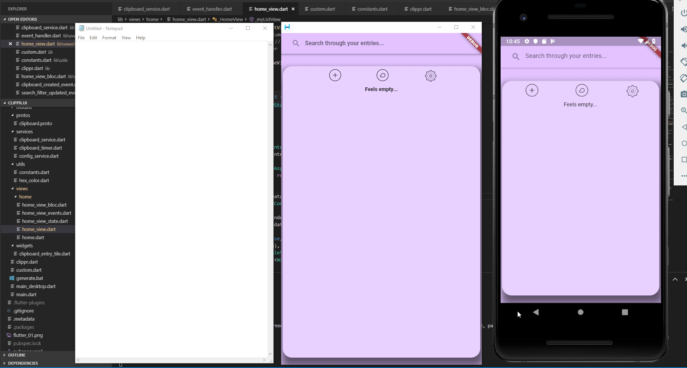

# Intro

Ever needed to quickly copy some text from your phone to pc or vice versa? Clippr comes in handy for those situations, you can keeep your clipboard content synchronized across your devices. The service is written in C# with ASP.NET Core 3.0 utilizing gRPC for the communication and MongoDB for the persistence. The UI part is written in Dart using Flutter. The desktop version is possible thanks to: https://github.com/go-flutter-desktop/go-flutter

# Installation
  - Have a MongoDB instance running, the service will connect by default to mongodb://localhost:27017
  - Run the service
  - Run the flutter app
  - In the settings view, set the "Endpoint" to either "10.0.2.2" if being ran from the emulator, or set it to "localhost" if you're running the desktop version using hover.
  - Set the device name which you want to appear above the created entries

# Features
  - Sychnronize clipboard content realtime across devices using gRPC streaming
  - Automatically push clipboard content ( can be enabled/disabled in the settings )
  - Search through created clipboard entries

# Requirements
  - gRPC for Dart needs to be installed manually ( https://grpc.io/docs/quickstart/dart/ )
  - Visual Studio 2019
  - .NET Core Runtime 3.0.100-preview4-011223
  - MongoDB database
  - If you want to test the Desktop version ( https://github.com/go-flutter-desktop/go-flutter )

# Thanks to

UI inspired by: https://dribbble.com/shots/6468926-Notes-Widget \
All the people who worked on the flutter packages I am using

Notes
-
   This was just a simple poc because I wanted to test gRPC with Flutter. So key things such as error handling, tests etc are missing.

License
-

MIT